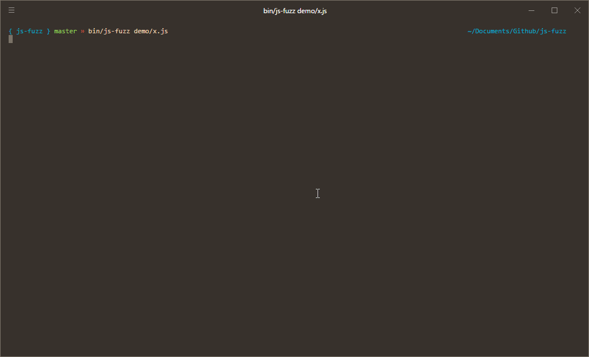

# js-fuzz



> This is still very much a work in progress and is probably not suitable for "real" use yet!

js-fuzz is an [American Fuzzy Lop](http://lcamtuf.coredump.cx/afl/)-inspired fuzz tester for JavaScript code. It provides coverage-driven analysis and minimization while being fast and extraordinarily simple to use.

### Example

This program tests that all valid JSON strings can be parsed with [JSON5](http://json5.org/):

```js
const JSON5 = require('json5')

exports.fuzz = input => {
  input = input.toString('utf8') // we give you buffers by default

  let isPlainJSON = true
  let isJSON5 = true
  try { JSON.parse(input) } catch (e) { isPlainJSON = false }
  try { JSON5.parse(input) } catch (e) { isJSON5 = false }

  // We catch and thrown errors and mark them as failures
  if (isPlainJSON && !isJSON5) {
    throw new Error('Found a string that was JSON but not JSON5');
  }

  return isPlainJSON ? 1 : 0
}
```

### Usage

```
js-fuzz myFile.js
```

Usage is quite similar to [go-fuzz](https://github.com/dvyukov/go-fuzz#usage). You should give the `js-fuzz` tool the path to a module that exports a `fuzz` function. This function will be called with an input Buffer, and should return:

 - `-1` if that input should not be fed back into the fuzzer, even if it gives us better coverage
 - `1` if the fuzzer should increase the priority of the given input
 - `0` to let the fuzzer decide

In the above example, we asked to increase the priority of strings that can be parsed as plain JSON, since we want more of that sort of thing in order to test against JSON5. You can also return Promises from the `fuzz` function, or take a callback.

```js
exports.fuzz = input => {
  return doSomethingAsync(input)
    .then(out => anotherThing())
    .then(valid => valid ? 1 : 0)
}

// or

exports.fuzz = (input, callback) => {
  myNodeStyleThing(input, err => {
    if (err) {
      callback(err)
    } else {
      callback(null, 1)
    }
  })
}
```

The fuzzer will run until you terminate it, reporting stats in your terminal, and will write output in the form of text files into a `fuzz-output` directory in your current working directory. You'll probably be most interested in `./fuzz-output/crashers`, which will contain all inputs that caused an error in your program!

js-fuzz does assume that your program's behaviour is deterministic and that the `fuzz` function is [pure](https://en.wikipedia.org/wiki/Pure_function). It will work when this does not hold true, but it will be less efficient at discovering code paths and edge cases.

### Internals

The runner spawns child processes which execute the given input module, by default spawning one child per CPU core. We use Esprima and Escodegen to provide branch coverage on JavaScript code using a `require` hook. The coverage that's injected has little performance impact; running a benchmark on Douglas Crockford's JSON implementation, it's about a 0.6% overhead. Most of the mechanics are based heavily on the [AFL whitepaper](http://lcamtuf.coredump.cx/afl/technical_details.txt).

#### Limitations

Most limitations revolve around what Node will let us get at without leaning on native extensions, which I would prefer to avoid for maintainability and compatibility reasons.

 - This doesn't currently work in browsers, though I want it to do so in the future.
 - We don't have any coverage analysis for native extensions and I am not planning on adding it (though I am open to PRs).
 - This implementation is bounded, at least in simple programs by memory throughput; much copying and moving has to be done as slave processes serialize and unserialize data with communicating with the master. Outside of writing native bindings I am unsure how this problem could be addressed.
 - We aren't always able to collect coverage statistics for tasks which time out. While we still record the input, we aren't able to dedupe test cases.

#### Acknowledgments

 - The [AFL](http://lcamtuf.coredump.cx/afl/) project is the original fuzzer and is where most of the beautiful mechanics originated from.
 - Many mechanics in this implementation are derived from [go-fuzz](https://github.com/dvyukov/go-fuzz), which was also my original introduction to fuzzing. Dmitry talks through some of the internals [here](https://www.youtube.com/watch?v=Ef7TtSZlmlk).
